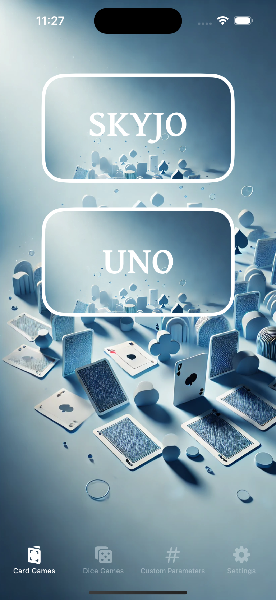
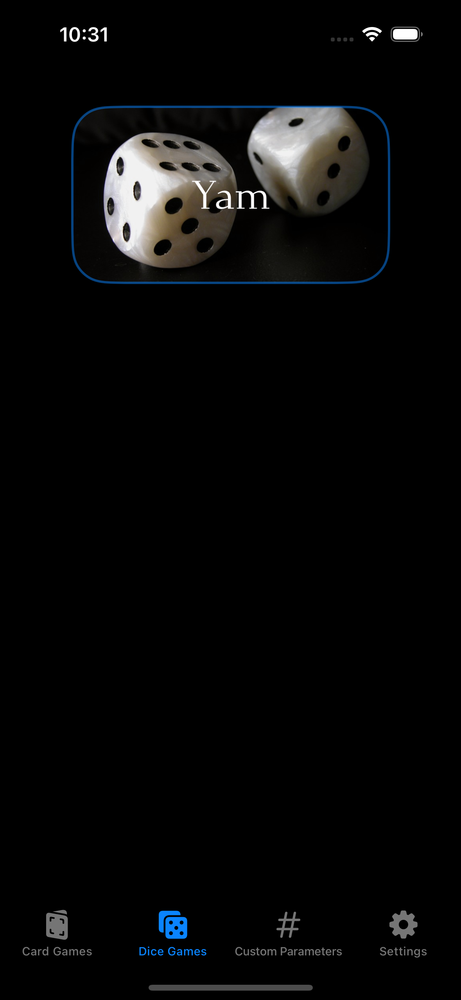
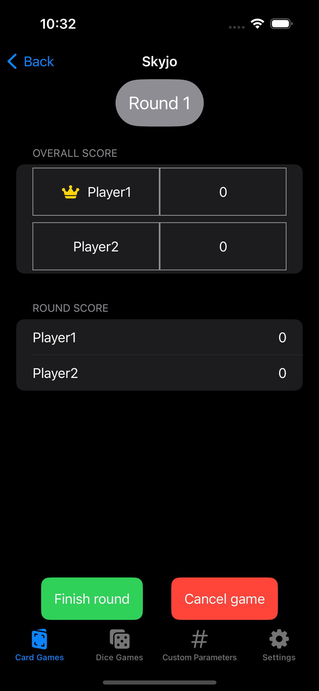

# Score

## Description
Score est une application intuitive dédiée à la gestion des scores pour vos parties de jeux de société. Simplifiez le suivi des scores et concentrez-vous sur l'essentiel : vous amuser avec vos proches.


## Fonctionnalités principales
- Gestion des scores en temps réel : Ajoutez ou modifiez les scores facilement pendant le jeu.
- Support pour plusieurs joueurs : Gérez les scores de tous les participants.
- Interface utilisateur fluide : Profitez d’une expérience de navigation optimisée avec un design élégant et des options de défilement horizontal.
- Boutons d’action rapide : Terminez une manche ou annulez une partie en un clic.
- Personnalisation : Compatible avec une variété de jeux de société.
- Aperçu :
<div>
  
  
  
</div>


## Technologies utilisées
- Langage : Swift
- Framework : SwiftUI
- Plateforme : iOS


## Installation
- Clonez le dépôt :
```bash
git clone https://github.com/M0dzie/Score
```
- Ouvrez le projet dans Xcode.
- Compilez et lancez l'application sur un simulateur ou un appareil iOS.

## Contribuer
Les contributions sont les bienvenues ! Suivez ces étapes pour proposer des améliorations :

- Forkez le projet.
- Créez une branche pour vos modifications :
```bash
git checkout -b feature/improvement
```
- Faites un commit de vos changements :
```bash
git commit -m "Add: new features"
```
- Poussez la branche :
```bash
git push origin feature/improvement
```
- Ouvrez une Pull Request.


## Licence
Ce projet est sous licence MIT. Consultez le fichier [LICENSE](LICENSE) pour plus de détails.
